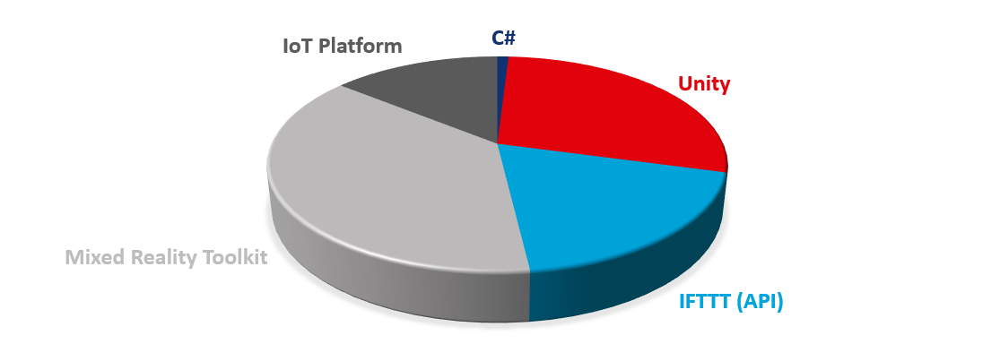

# Introduction

## The Technologies
With all the new technologies out there which focus is for humanity to move forward, there were two technology that caught my attention. These are the Augmented Reality and Smart Home (IoT). Augmented Reality a.k.a. AR focuses in making digital entities being augment to real world, it enhances real world objects by means of computer-generated perceptual information such as visual and auditory. Smart Home on the other hand allows you to digitally control home appliances such as lights, thermostat, air conditioning, ventilation and leak sensors. 

## Current 
All the big companies such as Google, Apple, Amazon and Microsoft already invested to these technologies as we speak. There is the HoloLens from Microsoft for example, HoloLens is the best devices out there which aim is to make Mixed Reality available for industries such as manufacturing and health care to improve their productivity. In Smart Home industry there this Google Assistant and Amazon Alexa which aim is to give homeowners the ability to control smart home devices, they even teamed up to define a Framework which aim is to standardize Smart Devices Architecture. 

## Future
It was predicted that the global number of smart home devices will skyrocket in the next 5 years and that smart home devices will be 5:1 ratio compares to smart phones or maybe even higher. With regards to Augmented Reality, the technology is already available the industry just needs creative minds like us to let the technology move forward. 

## The Plan
With all this information in mind, it is the right time for ERNI to build its own portfolio in these technologies and that is where I come up with the idea “why not build an app that will make the two technology work seamlessly that it will work like magic?”

# ERNI Benefits

## Software Developers
This masterpiece will be provided to developers who would like to work in Augmented Reality (focused on HoloLens device) and/or SmartHome (IoT) project as a reference to start building this kind of application.

## The Company
New technology means new project opportunities for the company, the idea is to start building promotional applications that caters possible applications of these technologies.

## Business Developers
The masterpiece aims to provide a promotional video and a demo app that they can show the prospect clients what kind of applications we can build out of these technologies.

# Tools and Libraries
## Mixed Reality Toolkit 2.4
Mixed Reality Toolkit gives the masterpiece owner to easily build an App that is MR/VR/AR cross-platform. The demo application can run in Mixed Reality headsets manufacture by HP, DELL, Asus and Lenovo and of course HoloLens 1 and HoloLens 2 are not the least to mention. HoloLens 1 and HoloLens 2 are the target devices of this demo app. This library aims it to make HoloLens App development as easy as possible, with all the out-of-the-box features that the library provides 95% of the HoloLens app was developed thru drag and drop.
## IF THIS THEN THAT (IFTTT)
Making the AR and Smart Home devices work together make it easier with the help of IFTTT. This is responsible in building the set of API used by the HoloLens App to control the smart home devices. This platform turned this masterpiece into a piece of cake. IFTTT provides developers a way to trigger certain actions of smart home devices via Webhook. For future demo apps, building a IFTTT connector would be a great addition to ERNI’s portfolio.
## Unity 2019.4
Unity is the main IDE used to develop the demo app. Unity is mainly used for Game development, it provides user friendly tools that makes it easy to use once you know where things are.
## C Sharp (C#)
The scripting language used by Unity, whenever some instruction is not provided by Unity or MixedReality toolkit developers can use C# script to write the set of computer instructions using C#
## IoT Platform
Most smart home devices in the market are controlled using IoT Platforms such as Smart Life, Tuya, eWelink, SmartThings and Magic Hue. As long as the IoT platform is compatible for IFTTT integration, building application that manages IoT device thru web application, desktop, hololens app or even windows service would be possible. With regards to the IoT platforms and devices I used in this demo App, below is the complete list:
- eWelink 
  - Lights (Smart Wall Light Switch)
  - Fan (Smart Switch Module)
- Smart Life
  - TV (Smart IR)
  - Aircon (Smart IR)
- Magic Hue
  - LED Strip Lights (Wifi LED Controller)

# Development Cost
Working with out-of-the-box easy-to-use platform is not for free of course but fortunately it is not that expensive to setup.
Below is the list of platforms and their cost. Those with asterisk (*) are the plan I used to develop the demo app.

## eWelink
Plan | Cost (Yearly) | Description
---- | -------------:| -----------
Free Plan|-| 
Advance Plan * | $9.99 | required for IFTTT integration

## IFTTT
Plan | Cost (Monthly) | Description
---- | --------------:| -----------
Basic|-| 3 Applet maximum
Pro * | $3.99 | Unlimited Applet, Supports multiple IF condition, Supports multiple action per Applet

## Unity
Plan | Year per Seat | Description
---- | -------------:| -----------
Student|-| Learn the tools and workflows professionals use on the job
Personal * |-| Start creating with the free version of Unity
Plus| $399.00 | refer to [Business Plans](https://store.unity.com/#plans-business)
Pro	| $1,800.00 | refer to [Business Plans](https://store.unity.com/#plans-business)
Enterprise | $4,000.00 (20 seats) | refer to [Business Plans](https://store.unity.com/#plans-business)

For Unity complete price list comparison please refer to https://store.unity.com/compare-plans?currency=USD 

## Others
**Smart Life** and **Magic Hue** are currently free with no limitations. 

# App Composition
With all the efficiency provided by each tools and libraries I used only less than 5% of the effort is coding. For an MVP you only need to call the GET API that will be provided by IFTTT which is only around 20 lines of code.

 

# Lesson Learnt

## Software Development
I’ve been working as software developer for the past 10 years and sometimes we forgot to think that there are already features provided by our libraries which makes the development easy. Always look for these things and development will be easier. 

## Augmented Reality Development
When working with augmented Reality App having a creative mind may not be enough. Clearing your mind can help you at some point. Imagine that “Monitors” never existed, from there visualize how AR could improve our day to day live. “How can you enhance the real world with computer generated information”, “How will you make computer generated information benefit from the real world”, “How will you make the real world benefit from computer generated information”. With all these in mind you’ll end up of something amazing.

## Unity Development
Knowing the basic would mean a lot, when developers plan to build applications using Unity I would suggest this Udemy Course [Complete C# Unity Game Developer 3D](https://www.udemy.com/course/unitycourse2/). It will teach you the unity basics, it even walkthrough you in building 4 different games and most importantly it teaches you the good stuffs for beginners.

## MixedReality Toolkit Development
Learn from documentation is a great thing, HoloLens development community is not big enough to refer from other developers. Most of the time you will end up learning from the documentation itself which is kind of the right way to all framework out there actually.

# Project References

## MixedReality-Toolkit
Provides the cross-platform input system and building blocks for spatial interactions and UI 
- https://github.com/microsoft/MixedRealityToolkit-Unity 
- [Documentation](https://github.com/microsoft/MixedRealityToolkit-Unity#documentation)
- [Required Software](https://github.com/microsoft/MixedRealityToolkit-Unity#required-software)
- [Unity Packages](https://github.com/microsoft/MixedRealityToolkit-Unity/releases/tag/v2.4.0) under Assets section. 
-	[Demos App](https://github.com/microsoft/MixedRealityToolkit-Unity#example-scenes)

##	Unity
World's Leading Real-Time 2D and 3D Development Platform.
-	https://unity.com/
-	[Plans](https://store.unity.com/compare-plans)
-	[Udemy Course](https://www.udemy.com/course/unitycourse2/)
-	[MixedRealityToolkit](https://github.com/microsoft/MixedRealityToolkit-Unity/releases/tag/v2.4.0) packages
-	[Installers](https://unity3d.com/get-unity/download) (suggest using Unity Hub, to easily manage multiple Unity versions)

##	IFTTT
Allows users to create chains of conditional statements triggered by changes that occur within other web services and smart home devices
-	https://ifttt.com/home
-	[Plans](https://ifttt.com/plans)
-	[HTTP Trigger (Webhook)](https://ifttt.com/maker_webhooks)
-	[Developer Docs](https://platform.ifttt.com/docs) (was never used in this Masterpiece but for future IFTTT integration this will be the best place to start)

## Tuya/Smart Life
IoT Platform
-	https://www.tuya.com/

## eWeLink
IoT Platform
-	https://www.ewelink.cc/en/

# Resources

## GitHub Sourcecode
The source code is currently publicly available. This is to promote the idea to combine the two technology not only for ERNIans but also to other AR/IoT Developers out there who would like to explore posibilities in order to move the technologies forward.

https://github.com/ERNICommunity/ERNI.SmartHomeAR

## Initial Promotional Video
Here is an first promotional video about how the Masterpiece’s capabilities.

